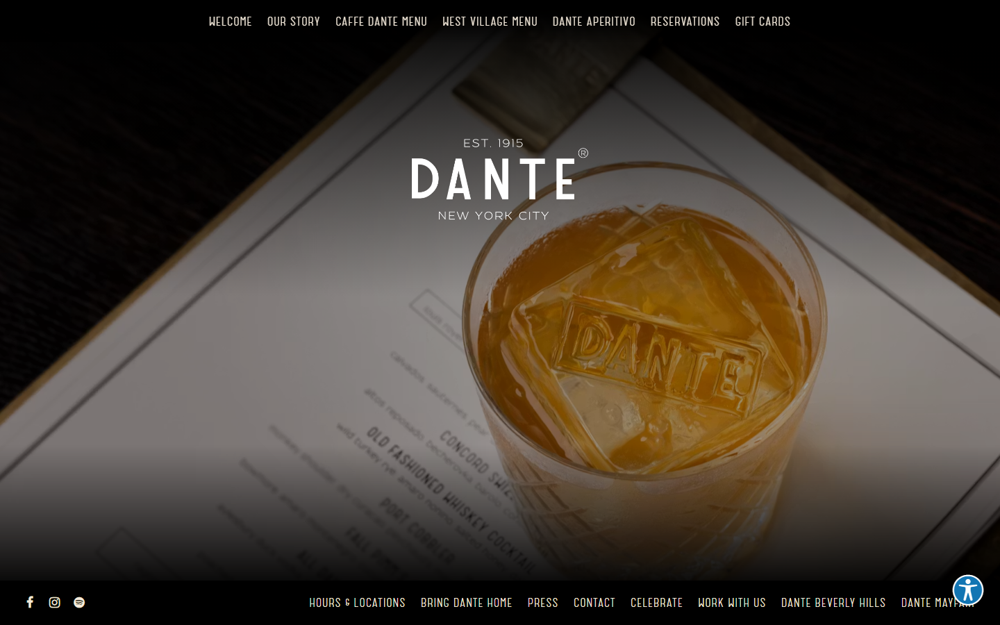
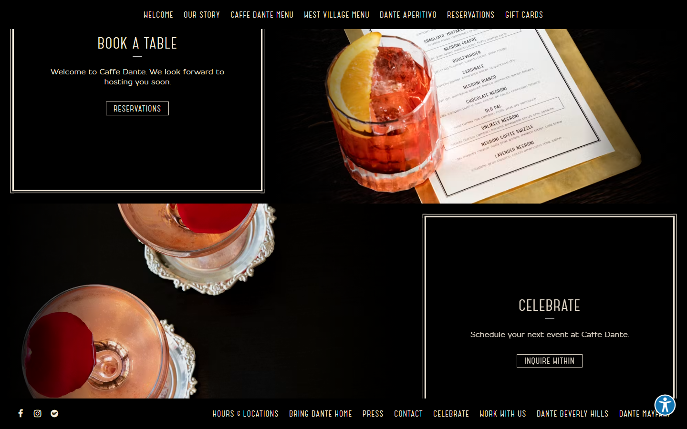
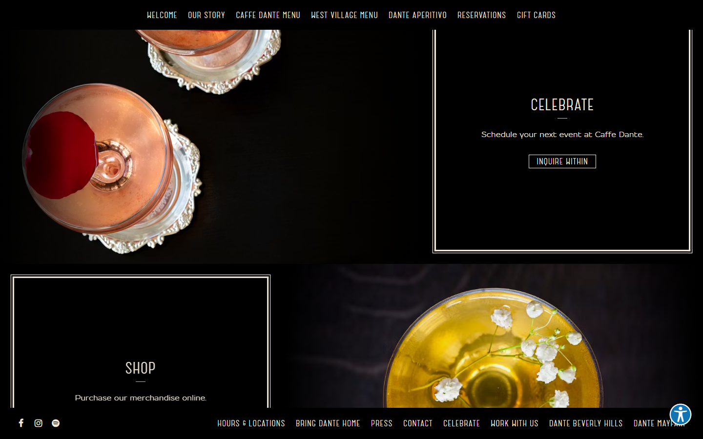
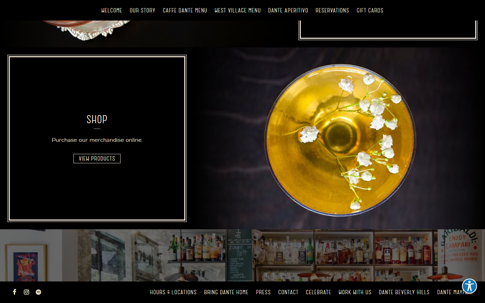
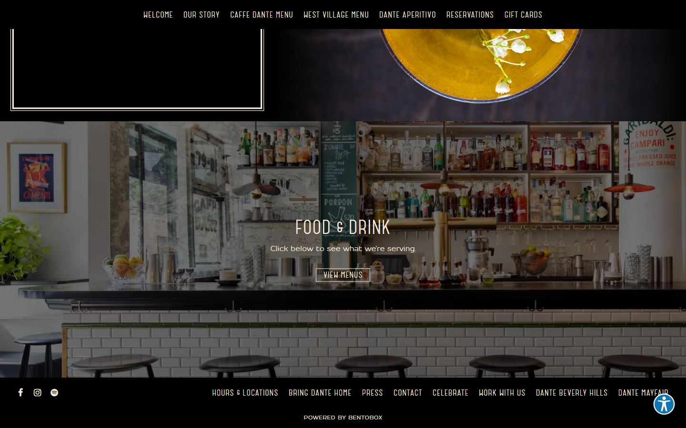

# Animation Reference

> Cinematic motion design extracted from live DOM. Follow these specs exactly to recreate the experience.

## Motion Technology Stack

Pure CSS animations — no external animation libraries detected.

## Scroll Journey

The page is **3,404px** tall. Each frame below shows what the user sees at that scroll depth.

> **Use these screenshots to understand WHAT animates, WHEN it animates, and HOW it moves.**

### 0% — Top / Hero
Scroll position: 0px



### 17% — Opening Section
Scroll position: 426px


### 33% — First Feature Section
Scroll position: 826px


### 50% — Mid-Page
Scroll position: 1,252px



### 67% — Lower Content
Scroll position: 1,678px



### 83% — Near Footer
Scroll position: 2,078px



### 100% — Bottom / Footer
Scroll position: 2,504px



## Global Transition Declarations

These `transition` values were extracted from CSS rules across the site:

```css
transition: max-height 1.5s 0.5s;
```

## How to Recreate This Motion Design

### Step 2 — Scroll-Reveal Pattern

Elements that animate into view follow this pattern:

```css
/* Initial hidden state */
.reveal {
  opacity: 0;
  transform: translateY(40px);
  transition: opacity 1.5s cubic-bezier(0.4, 0, 0.2, 1),
              transform 1.5s cubic-bezier(0.4, 0, 0.2, 1);
}
.reveal.visible {
  opacity: 1;
  transform: translateY(0);
}
```

### Step 3 — Key Motion Principles

- **Duration scale:** `1.5s` · `0.5s` — use these values, never invent new durations
- **Always add** `@media (prefers-reduced-motion: reduce) { * { animation-duration: 0.01ms !important; transition-duration: 0.01ms !important; } }`

### Step 4 — Scroll Journey Reference

Match what happens at each scroll position:

- **0%** (`0px`) → `screens/scroll/scroll-000.png`
- **17%** (`426px`) → `screens/scroll/scroll-017.png`
- **33%** (`826px`) → `screens/scroll/scroll-033.png`
- **50%** (`1252px`) → `screens/scroll/scroll-050.png`
- **67%** (`1678px`) → `screens/scroll/scroll-067.png`
- **83%** (`2078px`) → `screens/scroll/scroll-083.png`
- **100%** (`2504px`) → `screens/scroll/scroll-100.png`

